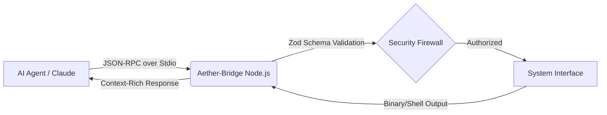

<div align="center">

# 🌌 Aether-Bridge
### The AI-to-System Autonomous Nexus
[](https://opensource.org/licenses/MIT)
[](https://modelcontextprotocol.io)
[](https://www.typescriptlang.org/)
[](https://nodejs.org/)

**Aether-Bridge** is a high-performance, industrial-grade implementation of the **Model Context Protocol (MCP)**. It acts as a secure, bidirectional bridge, giving AI models "hands" to interact with local operating systems, file systems, and security tools.

[Explore Walkthrough](#-technical-architecture) • [View Features](#-key-capabilities) • [Quick Start](#-getting-started)

</div>

---

## 🚀 Key Capabilities

| Feature | Description | Professional Use Case |
| :--- | :--- | :--- |
| **🛡️ Secure Handshake** | Full Stdio transport layer implementation. | Enterprise AI Integration |
| **🔍 Binary Analyst** | Deep-scan for strings & syscall patterns. | Malware Analysis & RE |
| **📂 Deep Explorer** | Recursive file-system access with Zod validation. | Data Science & Organization |
| **💻 God-Mode Shell** | Real-time PowerShell/Bash execution. | DevOps & System Admin |
| **⚡ System Scout** | Real-time hardware & telemetry metrics. | Infrastructure Monitoring |

---

## 📐 Technical Architecture

<details>
<summary><b>View Internal System Design</b></summary>

The Aether-Bridge server operates on a non-blocking, asynchronous event loop, ensuring minimal latency between AI prompts and system actions.


</details>

---

## 🛠️ Tech Stack

<div align="center">

| Core | Security | Runtime |
| :---: | :---: | :---: |
| TypeScript 5.4 | Zod Validation | Node.js 20+ |
| MCP SDK | Path Sanitization | ESM Modules |

</div>

---

## 🏃 Getting Started

<details>
<summary><b>Step-by-Step Installation</b></summary>

1. **Clone & Enter**
   ```bash
   git clone https://github.com/kamalesh4044/aether-bridge.git && cd aether-bridge
   ```
2. **Initialize Environment**
   ```bash
   npm install && npm run build
   ```
3. **Connect to Client**
   Add this to your `claude_desktop_config.json`:
   ```json
   {
     "mcpServers": {
       "aether-bridge": {
         "command": "node",
         "args": ["C:/path/to/aether-bridge/build/index.js"]
       }
     }
   }
   ```
</details>

---

<div align="center">

### Developed with 🖤 by [Kamal](https://github.com/kamalesh4044)
*Part of the Elite Engineering Series*

</div>


---
<br>
<div align="center">
  <a href="https://github.com/kamalesh4044/aether-bridge">
    
  </a>
</div>

