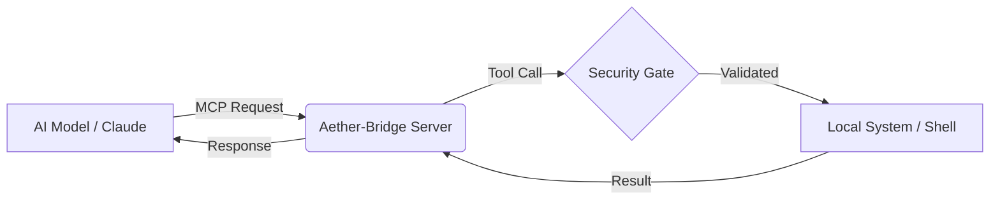

# 🌌 Aether-Bridge: The AI-to-System Nexus

**Aether-Bridge** is a high-performance, professional-grade implementation of the **Model Context Protocol (MCP)**. It provides a secure, bidirectional bridge between Large Language Models (LLMs) and local operating systems.

---

## 🚀 Key Features

- **🛡️ Secure Handshake**: Full implementation of the MCP Stdio transport layer.
- **⚡ System Scout**: Real-time telemetry (CPU, RAM, OS Specs) for the AI model.
- **📂 Deep Explorer**: Full file-system access (List/Read) with path validation.
- **💻 God-Mode Shell**: Secure execution of PowerShell/Bash commands directly from AI prompts.
- **🏗️ Industrial Architecture**: Built with TypeScript, Zod validation, and asynchronous processing.

---

## 🛠️ Tech Stack

- **Language**: TypeScript
- **Runtime**: Node.js
- **Protocol**: Model Context Protocol (MCP) SDK
- **Validation**: Zod (Schema-first validation)

---

## 📐 Architecture Diagram



---

## 🏃 Getting Started

### Prerequisites
- Node.js (v18+)
- TypeScript installed globally (`npm install -g typescript`)

### Installation
1. Clone the repository:
   ```bash
   git clone https://github.com/your-username/aether-bridge.git
   cd aether-bridge
   ```
2. Install dependencies:
   ```bash
   npm install
   ```
3. Build the project:
   ```bash
   npm run build
   ```

---

## 👤 Author
**Kamal** - *Systems & AI Developer*
